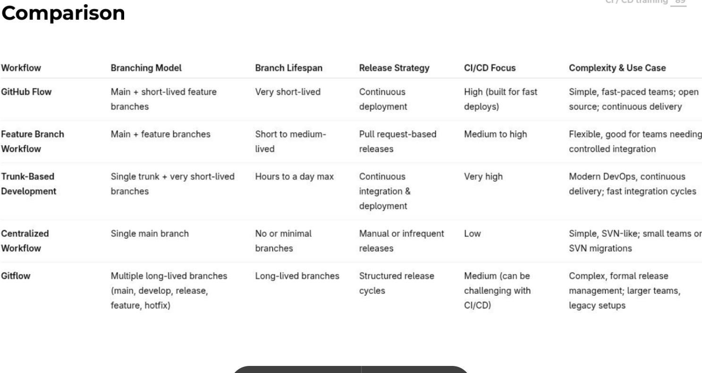

# Interview Preparations

## Java

## Devops

 - [List of devops tools](https://landscape.cncf.io)
 - 12 Factor Authentication app

## Deveops Educamp observation

- Cilium concepts is network as service
- *Terraform is used generaaly for infrastracutre outside of vm, ansible is generally used for inside the vm*
- *The best practice is still to create a gitlab runner for each group at least using tags*
- Harbor is another registry for registry and packages
- In frontend projects and especially in React/js you have to pass variables in the build because the code does not run on your server, but on the customer server, so the build needs to be created with the variable already defined. If you need to do it at runtime you have to create a awful script which replace in the big js file (the bundle.js) the placeholder of your variable with the real value.
- git add and commit both files and files' metadatas so if you need to run a script inside the pipeline you have to add the executable (+x) attribute
- Git Workflow could be different and this could be a question in an interview. 
- In tracing samplig strategies means that you won't collect all the traces, which is a little bit too much for data, but you pick up samples, based on error etc... more or less like prometheus exemplars.
- GItlab SAST analyze the soure code for voulnerabilities. It is like sonarqube
- Gitlab DAST is really useful, you can create a dev environemnt and run DAST for testing 

